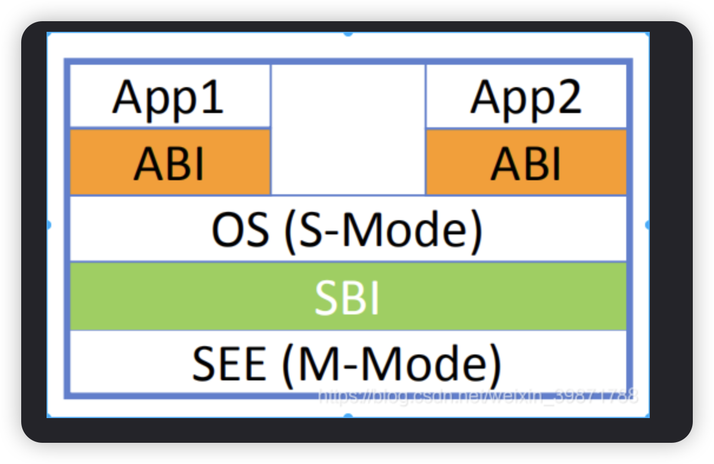
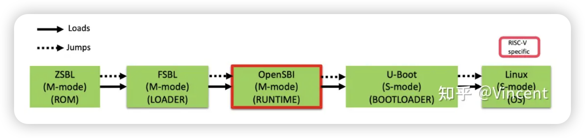
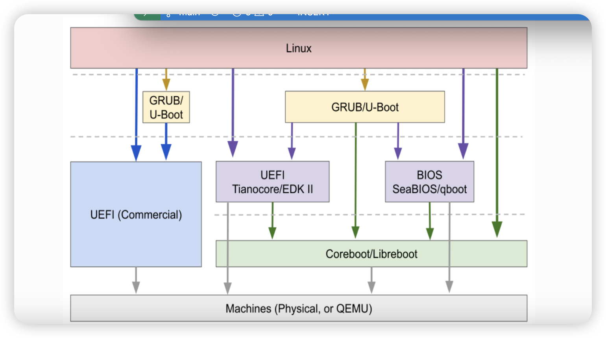

## ABI (application binary interface)
1. 函数调用对寄存器的使用
2. linux做系统调用的嘶吼，调用号应该在的寄存器

## SBI (Supervisor binary interface)
### riscv
1. 多级BootLoader
2. 
3. 

## rusc-v boot process

## supports FW
FW_DYNAMIC 
FW_JUMP
FW_PAYLOAD

## RUN M mode

## UBOOT (universal Boot Loader)

## what is bootloader?
The bootloader is a boot program what read system kernel code from flash/disk/ssd to memeory
ROM -> RAM -> OS
## OPENSBI is a first-level bootloader,a lower-level boot layer

## UEFI/GRUB/BIOS

