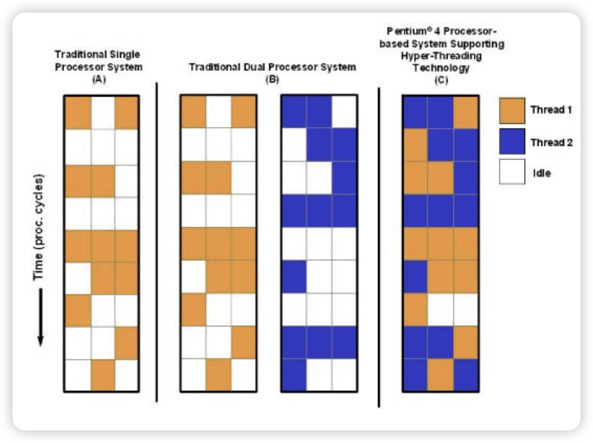

# setting swap memeory
```bash
mkdir swap && cp swap
sudo dd if=/dev/zero of=swapfile bs=1M count=2048
sudo chmod 0600 swapfile
sudo mkswap swapfile
sudo swapon swapfile

``` 

# free swap memeory
```
sudo swapoff swapfile
```

# 开机使用 
```
vim /etc/fstab
swapfilepath swap swap defaults 0 0
```

# kernel virtual memeory
```
1. 0  swappiness = 0 不使用虚拟内存
2. 100 积极使用虚拟内存
# 写入自动挂载参数
if ! grep -q swap /etc/fstab; then
    echo "/mnt/swap swap swap defaults 0 0" >> /etc/fstab
fi
# 设置虚拟内存使用率
if ! grep -q swappiness /etc/sysctl.conf; then
    echo "vm.swappiness = 10" >> /etc/sysctl.conf
else
    sed -i 's/vm.swappiness = 0/vm.swappiness = 10/' /etc/sysctl.conf
fi
# 使配置生效
sysctl -p

```

# using bbr
```
net.ipv4.tcp_congestion_control = bbr

```

# sar
```
怀疑CPU存在瓶颈，可用 sar -u 和 sar -q 等来查看
怀疑内存存在瓶颈，可用sar -B、sar -r 和 sar -W 等来查看
怀疑I/O存在瓶颈，可用 sar -b、sar -u 和 sar -d 等来查看
```

# 单核， 多核，超线程(逻辑核)

超线程（HT）：超线程和多线程不同，多线程是程序方面的属于软的代码级别的，超线程是硬件架构方面的，通过控制器来模拟逻辑核心。
超线程有什么作用？其实也是为了提高效率更高的榨干控制器的运行能力。为什么这么说呢，因为任务过来之后很多时候不是马上就能由运算器进行计算的，它还需要其他资源比如网络传输过来的数据或者是硬盘中的数据，那么此时运算器就闲着，为了更大限度利用运算器，我可以设置2个控制器对应一个运算器，其中一个控制器处理的程序需要等待数据的时候，如果另外一个控制器处理的程序不需要等待或者数据已经准备好，那么就可以立即发送给运算器进行计算。
下图蓝色和橙色都是CPU的运算器在工作，白色表示运算器空闲。A图是单核心、B图是双核心、C图是单核心启用超线程，可以看到C图的CPU利用率最大。


争抢：核心上运算器只有一个，但是控制器2个，如果来的一个任务那么这两个控制器就需要协调一下谁来处理，所以这个会有一定损耗。这就相当于线程池中的惊群概念。
发生拥挤：物理核心太多如果开启HT则逻辑核心增加一倍，如果这时候来了几百个任务，如何分配这些任务到哪些核心上就是个问题，虽然这是由操作系统来做的调度但是也会有额外损耗，相反你只有一个我就根本不需要考虑分配的问题。
