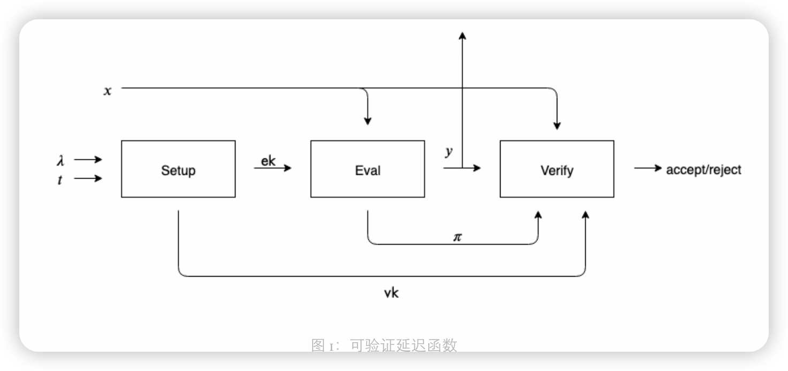

## Verifiable Delay Function

VDF -> math function,pow,让函数的计算需要一个已知的时间，即使在少量的CPU并行计算的情况。

VD(safe_args,time_args) -> proof
1. Uniqueness
2. Sequentiality

## what diffient  is VDF with POW
1. 多cpu和单cpu一样。多算力无法有优势
2. 唯一的合法解。pow拥有大量的解

