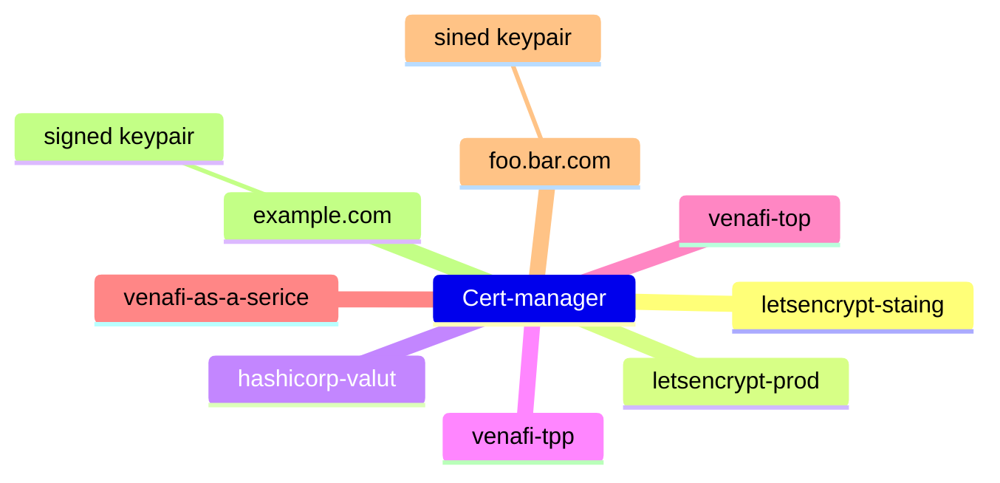

## cert-manager
- 


## Install
```bash
kubectl apply -f https://github.com/cert-manager/cert-manager/releases/download/v1.13.3/cert-manager.yaml
```
```bash 
cmctl
OS=$(go env GOOS); ARCH=$(go env GOARCH); curl -fsSL -o cmctl.tar.gz https://github.com/cert-manager/cert-manager/releases/latest/download/cmctl-$OS-$ARCH.tar.gz
tar xzf cmctl.tar.gz
sudo mv cmctl /usr/local/bin
```

```bash
treafik  args:
        - '--global.checknewversion'
        - '--global.sendanonymoususage'
        - '--entrypoints.metrics.address=:9100/tcp'
        - '--entrypoints.traefik.address=:9000/tcp'
        - '--entrypoints.web.address=:8000/tcp'
        - '--entrypoints.websecure.address=:8443/tcp'
        - '--api.dashboard=true'
        - '--ping=true'
        - '--accesslog=true'
        - '--accesslog.fields.defaultmode=keep'
        - '--accesslog.fields.headers.defaultmode=drop'
        - '--metrics.prometheus=true'
        - '--metrics.prometheus.entrypoint=metrics'
        - '--providers.kubernetescrd'
        - '--providers.kubernetesingress'
        - >-
          --providers.kubernetesingress.ingressendpoint.publishedservice=kube-system/traefik
        - '--entrypoints.websecure.http.tls=true'
        - '--certificatesresolvers.default.acme.tlsChallenge=true'
        - '--certificatesResolvers.default.acme.email="haroldtinsheng@gmail.com"'
        - '--certificatesResolvers.default.acme.storage="acme.json"
```