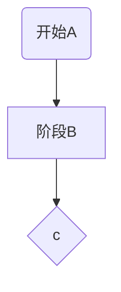

## treafik
- providers (static) 
- middlewares(dynamic)
- endpoint(static)
- routers(dynamic)
- services(dynamic)
- cert(dynamic)

## cert-manager 
- http01
- dns01

## mermaid

```mermaid
   stateDiagram
   direction TB

   accTitle: This is the accessible title
   accDescr: This is an accessible description

   classDef notMoving fill:white
   classDef movement font-style:italic
   classDef badBadEvent fill:#f00,color:white,font-weight:bold,stroke-width:2px,stroke:yellow

   [*]--> Still
   Still --> [*]
   Still --> Moving
   Moving --> Still
   Moving --> Crash
   Crash --> [*]

   class Still notMoving
   class Moving, Crash movement
   class Crash badBadEvent
   class end badBadEvent
   ```

   ```mermaid
   pie title Pets adopted by volunteers
    "Dogs" : 386
    "Cats" : 85
    "Rats" : 15
  ```
  ```mermaid
  graph TB
    sq[Square shape] --> ci((Circle shape))

    subgraph A
        od>Odd shape]-- Two line<br/>edge comment --> ro
        di{Diamond with <br/> line break} -.-> ro(Rounded<br>square<br>shape)
        di==>ro2(Rounded square shape)
    end

    %% Notice that no text in shape are added here instead that is appended further down
    e --> od3>Really long text with linebreak<br>in an Odd shape]

    %% Comments after double percent signs
    e((Inner / circle<br>and some odd <br>special characters)) --> f(,.?!+-*ز)

    cyr[Cyrillic]-->cyr2((Circle shape Начало));

     classDef green fill:#9f6,stroke:#333,stroke-width:2px;
     classDef orange fill:#f96,stroke:#333,stroke-width:4px;
     class sq,e green
     class di orange
     ```